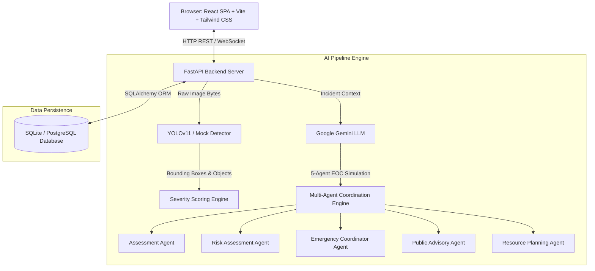

# CityPulse AI

> **AI-Powered Smart City Command Center**


---

## 📌 Project Logo & Preview

```
  ██████╗███╗   ██╗████████╗██╗   ██╗██████╗ ██╗  ██╗██╗     ███████╗███████╗    █████╗ ██╗
 ██╔════╝████╗  ██║╚══██╔══╝██║   ██║██╔══██╗██║  ██║██║     ██╔════╝██╔════╝   ██╔══██╗██║
 ██║     ██╔██╗ ██║   ██║   ██║   ██║██████╔╝██║  ██║██║     ███████╗█████╗     ███████║██║
 ██║     ██║╚██╗██║   ██║   ██║   ██║██╔═══╝ ██║  ██║██║     ╚════██║██╔══╝     ██╔══██║██║
 ╚██████╗██║ ╚████║   ██║   ╚██████╔╝██║     ╚█████╔╝███████╗███████║███████╗   ██║  ██║██║
  ╚═════╝╚═╝  ╚═══╝   ╚═╝    ╚═════╝ ╚═╝      ╚════╝ ╚══════╝╚══════╝╚══════╝   ╚═╝  ╚═╝╚═╝
                    AI-POWERED SMART CITY COMMAND CENTER
```

---

## 🌆 Overview

**CityPulse AI** is a next-generation, production-grade **Smart City Command Center** platform engineered to ingest, verify, analyze, and resolve urban emergencies and civic issues in real time. 

By integrating **YOLOv11 Computer Vision**, **Google Gemini LLM**, and a simulated **5-Agent Emergency Operations Center (EOC)** multi-agent system, CityPulse AI converts raw citizen incident reports and sensory feeds into structured, actionable municipal intelligence in under 10 seconds.

---

## 🎯 Problem Statement

Modern municipalities face critical challenges during emergency response and civic management:
- **Signal Overload & Delay**: Municipalities receive hundreds of unverified citizen calls and reports with redundant or inaccurate details.
- **Fragmented Inter-Departmental Coordination**: Sanitation, Fire, Traffic Police, and Disaster Response teams operate in silos without a unified real-time spatial operational picture.
- **Lack of Explainable AI**: Standard automation systems fail to give dispatch officers clear rationale for automated priority escalations or fleet routing.

---

## 💡 Solution

**CityPulse AI** bridges citizen reporting with automated, explainable municipal action:
1. **Multimodal Signal Ingestion**: Ingests citizen-uploaded photos, GPS coordinates, and issue categories.
2. **AI Computer Vision Verification**: YOLOv11 detects structural damage, fire, flood water, and road blockages instantly.
3. **LLM & Multi-Agent Reasoning**: Google Gemini and 5 specialized EOC agents evaluate impact severity, determine casualty risk, auto-generate public warnings, and recommend exact resource dispatches.
4. **Unified Operational Hub**: Real-time dashboards, interactive spatial maps, and archival forensics empower command officers to make decisions with high confidence.

---

## 🚀 Key Features

CityPulse AI includes the following core capability modules:

- 📱 **Citizen Incident Reporting**: Seamless portal for citizens to upload incident photos, select issue categories, auto-detect GPS coordinates, and track resolution timelines.
- ✅ **AI Incident Verification**: Automatic verification scoring engine using YOLO computer vision and spatial check bounds to classify report authenticity.
- 🧠 **Explainable AI**: Transparent, natural-language explanation cards detailing *why* an incident was escalated, which keywords triggered the classification, and what factors influenced severity scoring.
- 🗺️ **Emergency Intelligence Map**: High-performance interactive GIS map featuring dynamic cluster markers, infrastructure overlays, and instant incident drawer previews.
- 🎛️ **Mission Control Dashboard**: Comprehensive live operational matrix showcasing City Health Scores, active emergency levels, power grid stability, and real-time execution pipelines.
- 📡 **Real-Time Incident Monitoring**: Instant WebSocket push notification engine that alerts dispatchers as soon as new incidents are reported or analyzed.
- 📜 **Operations History**: Complete archival forensics and replay system with before/after visual audit logs, response durations, and status shift records.
- 🚒 **Resource Management**: Depot availability tracking and fleet dispatch control for Municipal Sanitation, Fire Services, Water Works, and Traffic Police.
- 💡 **AI Insights**: Automated predictive city feed offering early warning advisories (e.g., flood probability increases, traffic congestion re-routing recommendations).
- 📱 **Responsive UI**: High-contrast EOC dark mode design system built with custom CSS design tokens, smooth Framer Motion micro-animations, and full mobile/desktop responsiveness.

---

## 🏗️ Architecture Diagram



---

## 🛠️ Technology Stack

### Frontend
- **Framework**: React 18 with Vite
- **Language**: TypeScript 5.7
- **Styling**: Vanilla / Tailwind CSS 3.4
- **State & Routing**: React Router v6, Custom Hooks
- **Icons & Visuals**: Lucide React, Recharts, Leaflet / React-Leaflet
- **Animations**: Framer Motion, React Hot Toast

### Backend
- **Framework**: FastAPI (Python 3.12)
- **Database**: SQLite (Development / Demo) & PostgreSQL 16 (Production) with SQLAlchemy 2.0 ORM
- **Computer Vision**: Ultralytics YOLOv11 (ONNX Runtime Execution)
- **Language Model**: Google Gemini SDK (`google-genai`)
- **Real-Time Engine**: Native FastAPI WebSocket Manager
- **Validation**: Pydantic v2 Strict Models

---

## 📁 Folder Structure

```
you-are-a-senior-full-stack/
├── backend/                  # FastAPI Application Package
│   ├── ai_training/          # YOLOv11 model training scripts & Colab guide
│   ├── app/
│   │   ├── ai/               # YOLO detector, base interface, mock fallback
│   │   ├── api/v1/           # API endpoints (incidents, dashboard, map, ws)
│   │   ├── core/             # Process configuration & WebSocket manager
│   │   ├── db/               # Database session factories & base models
│   │   ├── llm/              # Gemini client, prompt builder, schemas
│   │   ├── modules/          # Core domain models (incidents, analyses)
│   │   └── services/         # AIService, LLMService, NotificationService
│   ├── tests/                # Automated pytest suite
│   └── Dockerfile
├── frontend/                 # React + Vite Frontend Application
│   ├── src/
│   │   ├── app/              # App entrypoint & route lazy-loading
│   │   ├── components/       # Layout, Navigation, Map, Analysis UI
│   │   ├── constants/        # Site configuration & constants
│   │   ├── hooks/            # Custom WebSocket & data hooks
│   │   ├── lib/              # API clients & domain helper functions
│   │   └── pages/            # Mission Control, Dashboard, Map, Reports, History
│   ├── index.html            # Application HTML shell
│   └── package.json
├── docs/                     # Technical Architecture & Guides
├── outputs/                  # Verification & System Reports
├── docker-compose.yml        # Multi-container orchestration
└── README.md
```

---

## ⚙️ Installation

### Prerequisites
- **Node.js**: v18.0 or higher
- **Python**: v3.11 or v3.12
- **Git**

---

## 💻 Running Locally

### 1. Backend Setup

```bash
cd backend

# Create Python Virtual Environment
python -m venv .venv

# Activate Virtual Environment (Windows PowerShell)
.venv\Scripts\Activate.ps1
# Or macOS/Linux:
# source .venv/bin/activate

# Install Dependencies
pip install -r requirements.txt

# Start Backend Server
uvicorn app.main:app --reload --port 8000
```
- **Backend API**: `http://localhost:8000`
- **Swagger Documentation**: `http://localhost:8000/docs`

### 2. Frontend Setup

```bash
cd frontend

# Install Dependencies
npm install

# Start Vite Development Server
npm run dev
```
- **Web Application UI**: `http://localhost:5173`

---

## 🐳 Deployment

### Deploying with Docker Compose

CityPulse AI is fully containerized for seamless multi-container production deployment.

```bash
# Copy reference environment variables
cp .env.example .env

# Build and start services in detached mode
docker compose up --build -d
```

- **Frontend Container**: Bound to Port `80`
- **Backend Container**: Bound to Port `8000`
- **PostgreSQL Container**: Bound to Port `5432`

---

## 🔮 Future Scope

1. **IoT Sensor Integration**: Ingest real-time water level, air quality, and acoustic gunshot/explosion sensors.
2. **Drone Autonomous Dispatch**: Trigger automated drone reconnaissance flights to incident coordinates upon YOLO detection.
3. **Multi-City Federation**: Enable multi-region command centers to share emergency resources during large-scale national disasters.
4. **Mobile Native Application**: Android & iOS native citizen report apps with offline caching and satellite SMS capabilities.

---

## 📄 License

Distributed under the MIT License. See `LICENSE` for more details.

---

## 🙏 Acknowledgements

- **Google DeepMind**: For cutting-edge AI architectures and Gemini LLM capabilities.
- **Ultralytics**: For the state-of-the-art YOLOv11 computer vision framework.
- **OpenStreetMap & Leaflet**: For open-source spatial visualization tools.
